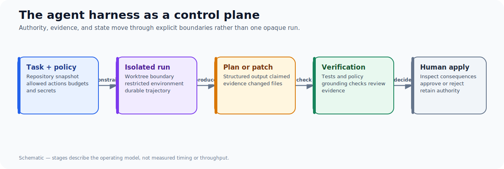
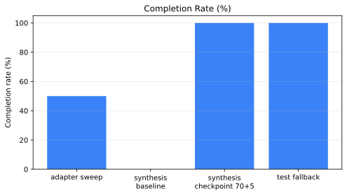
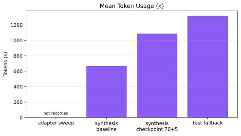

Coding agents can search a repository, propose a plan, edit files, and run tests. That does not yet make their work safe to delegate or their outcomes useful to learn from. A harness is the missing engineering layer: it constrains what an agent may do, records what it did, and applies the same verification standards to an agent-produced change that a careful reviewer would expect.

The harness was built around that premise. Its immediate role is a local-first control plane for work in a target repository; its larger purpose is to make agent-assisted development an inspectable research-and-development practice. The system isolates work in Git worktrees, applies execution budgets, removes secrets and live-trading settings from the environment, and separates inspection, planning, implementation, verification, review, and human-approved application.

The goal is not to make an agent look autonomous. It is to make the boundary between useful autonomy and engineering control explicit.

## The problem is not just code generation

Without a harness, an agent run often collapses into a single question: did it finish? That answer hides the questions that matter when the output will affect a real repository:

- Which repository state and task definition did it see?
- Was it permitted to write, run commands, or reach the network?
- Which tests and policy checks were actually run?
- Did a plan cite the right files and tests, or merely plausible-looking ones?
- How much time, model budget, and repair work did the result consume?
- Can someone reproduce the cohort and explain a surprising failure later?

A terminal success cannot answer those questions. Nor can a long transcript on its own. A useful harness makes the answers first-class artifacts.

## The operating model

The harness treats agent work as a bounded workflow rather than an unstructured chat loop:

Each layer has a different job. Isolation contains side effects. Budgets make costly or stalled work visible. Verification turns assertions into checks. Human approval retains authority over application. Durable artifacts let later experiments distinguish a promising mechanism from an accidental result.

## Why research belongs in the same system

The harness becomes more valuable when it can evaluate its own operating choices. For example, a checkpointed indexed-planner cohort completed 2/2 runs while its baseline completed 0/2, but the checkpoint cohort used more mean tokens and later manual review found semantic defects in both accepted plans. That is a useful result only because the study preserved repeat-level outcomes, cost, finalization behavior, and the plans for inspection.

Likewise, a later test-repair fallback cohort completed and verified 2/2 runs, recorded 22/22 grounding claims, and logged one successful repair. It is strong non-regression evidence. It is not direct proof of every repair branch: the exact empty-test-discovery branch was not exercised. The distinction matters. A research harness should make it easy to say both what improved and what remains unproved.

| What a harness records | Why it changes the decision |
| --- | --- |
| Repository snapshot, task, policy, and run ID | A reviewer can identify the conditions of the result. |
| Per-case outcomes and terminal states | A cohort rate does not conceal failed or malformed runs. |
| Verification, grounding, and repair telemetry | Completion can be separated from correctness and mechanism evidence. |
| Token, latency, and iteration data | An apparent gain can be weighed against operational cost. |
| Reports, scoreboards, and provenance manifests | Findings can be regenerated and challenged after the run. |

The early adapter-axis sweep makes the observability argument concrete. It reported 50% completion across two runs but no token figure, not because the work was free, but because that telemetry had not yet been materialized. Later cohorts retained token and trajectory evidence. Preserving the gap is part of the point: a system should expose its own blind spots instead of presenting a cleaner historical story than the artifacts support.

## What the harness is not

It is not a claim that every agent action can be automatically trusted. Deterministic checks, path grounding, and budgets reduce risk; they do not prove semantic correctness or product fitness. The checkpoint study is the counterexample: structurally accepted plans still cited nonexistent test paths and confused documentation with the implementation under review.

It is also not a substitute for engineers. The desired division of labor is deliberate: the system lets agents perform bounded exploration and produce evidence; engineers choose goals, define acceptance, inspect the important failure modes, and approve changes with real consequences.

## The series

This opening article provides the frame. The rest of the series investigates the individual controls and the evidence needed to evaluate them:

- [Experiments Should Be First-Class Product Artifacts](/blog/experiments-as-product-artifacts/) explains the artifact chain behind reproducible conclusions.
- [Benchmarking Agent Systems Beyond “Did It Finish?”](/blog/benchmarking-agent-repair-loops/) defines a scorecard spanning completion, verification, grounding, repair, and cost.
- [A Plan Can Validate and Still Be Unsafe to Implement](/blog/agent-plans-semantic-proof/) shows why structural checks need semantic review.
- [Grounding Is Necessary, Not Sufficient](/blog/grounding-is-not-semantic-proof/) separates file existence from claim correctness.
- [Designing Bounded Repair Loops for Agent Plans](/blog/bounded-agent-repair-loops/) turns a repair attempt into an observable control loop.
- [What a Two-for-Two Agent Result Actually Proves](/blog/interpreting-two-two-agent-results/) provides the language for interpreting small cohorts honestly.

## The standard to hold it to

The harness earns its complexity only if it improves decisions. A useful falsifier is straightforward: if a team cannot reconstruct a result, identify the conditions under which it ran, and explain why it passed or failed, the system is collecting activity rather than producing engineering evidence.

That is the motivation for the harness and for the research program around it: not agents that merely act, but agent-assisted development that can be inspected, challenged, and improved.
