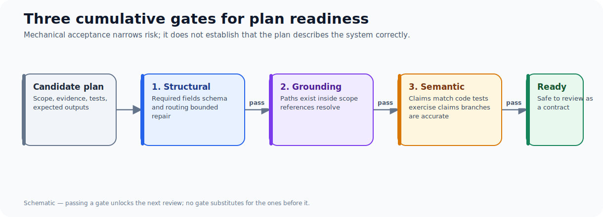
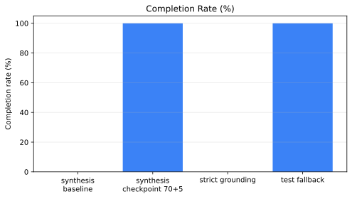
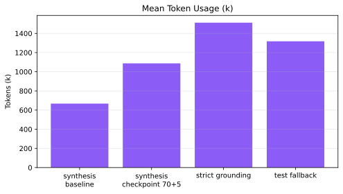

An agent plan is not ready to execute merely because it has the right JSON shape, cites files that exist, and survives a bounded repair loop. Those checks are useful, but they answer a narrower question: *can this plan be stored and mechanically inspected?* They do not answer whether the plan describes the system correctly.

This distinction emerged while evaluating an indexed planner that investigates a repository and emits an implementation plan. The headline result was attractive: an action-70 synthesis checkpoint completed both candidate runs while the two baseline runs completed neither. Manual review, however, found that the accepted candidate plans still cited nonexistent test paths, conflated controls implemented in different execution surfaces, and described failure modes contradicted by code.

The practical rule is simple: treat structural validity, reference grounding, and semantic readiness as separate gates.

## The intervention: force synthesis before the investigation becomes a loop

The planner normally chooses when to stop reading and submit a plan. The experiment added an opt-in checkpoint: after 70 actions, allow five more evidence actions and then require `finalize_plan`. The study used two repeats per arm on the same task and model configuration.

| Arm | Repeats | Completion | Verification | Mean tokens | Mean iterations |
| --- | ---: | ---: | ---: | ---: | ---: |
| Baseline | 2 | 0% | 0% | 667,729 | 42.5 |
| Checkpoint 70 + 5 | 2 | 100% | 100% | 1,087,231 | 67.0 |

The data is in `data/study-metrics.csv`; its source hashes and the full study locations are recorded in `data/evidence-manifest.yaml`.

That result is evidence that the checkpoint can improve *termination* in this narrow cohort. It is not evidence that the resulting plans are semantically sound. One candidate finalized before the checkpoint could be causal; one baseline failed before accepting a trajectory action. The group-average token comparison is also confounded by that short baseline failure.

## What the normal gates caught—and missed

The planner already had useful mechanical checks: non-empty task scope, evidence, tests, expected outputs, and path existence. A separate strict grounding cohort shows why they matter. Its one repeat completed 0%, recorded 15 plan-validation failures, and spent roughly 1.51 million tokens before terminating. The failure categories were missing evidence, missing scope, and missing tests.

But these checks have an obvious boundary. A test path can exist in the wrong directory; a documentation file can describe a control without that control being implemented by the component under review; a plausible prose summary can invert a branch's real behavior. None of those is a malformed field.

The manual review of accepted checkpoint plans found all three patterns:

1. **Wrong test locations.** The plans named tests under the wrong package root; the relevant tests live under `tests/unit/...`.
2. **Evidence-source conflation.** They attributed network isolation and environment scrubbing to a Docker backend even though the evidence belonged to other repository surfaces.
3. **Contradicted terminal-state claims.** They described exception and blocked paths as failures even where the code intentionally persists a resumable pause or routes normal success.

These are not cosmetic errors. They make an implementation plan unsafe as a contract for someone else to execute.

## A better readiness model

Use three gates, each with its own evidence and failure mode.

| Gate | Question | Good evidence | What it cannot prove |
| --- | --- | --- | --- |
| Structural validity | Is the plan complete enough to parse and route? | Schema checks; required fields; bounded repair | That its claims are true |
| Reference grounding | Do cited files and tests exist within declared scope? | Repository reads; path checks; expected-file declarations | That the cited file supports the claim |
| Semantic readiness | Does the plan accurately describe the relevant implementation, states, and tests? | Claim-to-code review; contradiction checks; targeted human review | That a future code change will work |

The gates should be cumulative. Passing the first two should unlock semantic review, not replace it.

## The useful counterexample: 2/2 success without direct mechanism proof

A later two-repeat fallback cohort completed 2/2, verified 22 of 22 grounding claims, and had one successful repair. That is a meaningful non-regression signal for the stricter finalization path. It did **not** re-trigger the precise nonexistent-test repair branch that motivated the fallback. Calling it a direct causal proof would be stronger than the data allows.

This is the same discipline the semantic gate demands from the planner: name what the evidence establishes and what it does not.

## What to test next

The next experiment should force the troublesome branch deterministically: submit an invalid test reference, have targeted discovery return no matching test, and verify that the repaired plan declares one exact planned test path in both `tests` and `expected_files`. That converts a unit-tested instruction into a live mechanism test.

In parallel, add semantic checks that compare a claim with the cited implementation branch, verify test-root conventions, and reject evidence that only describes a neighboring component. The goal is not to make planning impossibly strict. It is to stop confusing a well-formed plan with a trustworthy one.

## Cohort results at a glance

## Takeaways

- Completion is a termination metric, not a correctness metric.
- Path existence is necessary grounding, but it is not semantic evidence.
- Small, mixed cohorts can reveal mechanisms, but they rarely justify broad defaults.
- A plan becomes implementation-ready only when its claims survive structural, grounding, and semantic scrutiny.

The companion piece, [Benchmarking Agent Systems Beyond “Did It Finish?”](/blog/benchmarking-agent-repair-loops), turns those gates into a reusable measurement framework.
