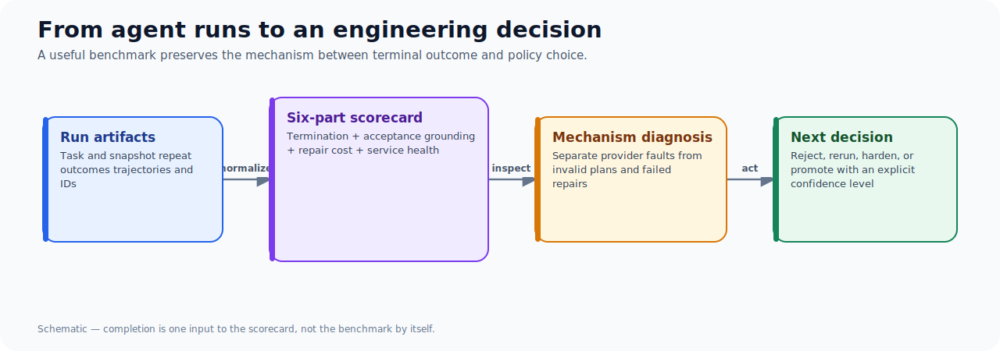
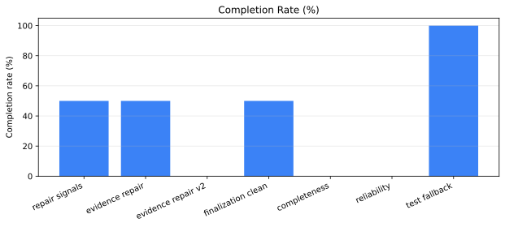
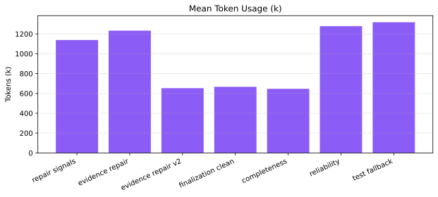

“Did the agent finish?” is a useful operator question and an inadequate research metric. It merges at least six different behaviours: whether the run terminated, whether output passed verification, whether the plan was grounded, how much repair it required, what it cost, and whether the same result can be reproduced.

The indexed-planner experiments behind this note use a compact scorecard that keeps those questions separate. The result is not a promise of statistical certainty—most cohorts have one or two repeats—but a better way to prevent a green completion cell from hiding an ungrounded or expensive outcome.

## The scorecard

| Dimension | Primary fields | Question answered |
| --- | --- | --- |
| Termination | completion rate, iteration count | Did the planner reach a terminal result? |
| Acceptance | verification pass rate, mean score | Did the harness accept the plan? |
| Grounding | claimed/verified references, grounding ratio | Are required references supported at the chosen level? |
| Repair | validation failures, repairs, successful repairs | Did feedback produce a valid revision efficiently? |
| Cost | input/output/total tokens, elapsed time | What did the outcome consume? |
| Service health | mean/max latency, transport failures | Was the result affected by model or provider behaviour? |

The article package owns the normalized source data in `data/study-metrics.csv` and `data/study-cases.csv`. The evidence manifest records the original scoreboards, reports, and manifests by hash.



## A worked sequence: the finalization cohorts

Seven two-repeat cohorts evaluated variations of strict plan finalization. They should not be read as one clean A/B: interventions accumulated, some runs hit provider issues, and individual failure modes changed. They are useful as a repair ledger.

| Cohort | Completion | Grounding | Mean tokens | Validation failures | Successful repairs |
| --- | ---: | ---: | ---: | ---: | ---: |
| Repair signals | 50% | 100% | 1.14m | 3 | 2 / 3 |
| Evidence-reference repair | 50% | 91.7% | 1.23m | 3 | 2 / 2 |
| Evidence-reference repair v2 | 0% | n/a | 653k | 2 | 1 / 1 |
| Finalization clean | 50% | 92.9% | 667k | 1 | 1 / 1 |
| Completeness guidance | 0% | n/a | 646k | 2 | 1 / 2 |
| Reliability validation | 0% | 0% | 1.28m | 4 | 2 / 2 |
| Test-repair fallback | 100% | 100% | 1.32m | 1 | 1 / 1 |

Two observations matter more than the final row's 100% headline.

First, a successful repair action is not the same as a successful run. The reliability cohort recorded two successful repair actions per the study metric, yet both repeats ultimately failed because the revised plans retained missing or nonexistent tests. Counting repair *attempts* without final outcome would overstate robustness.

Second, completion and grounding can move independently. The evidence-reference cohort completed only half its repeats but reported 11 verified references out of 12 claimed across the measured group. Reference-level grounding is informative; it does not guarantee that a run terminates or that the plan is semantically correct.

## Why raw trajectories belong beside the scoreboard

Aggregates tell us that a repair happened. Trajectories tell us what the planner did with the feedback.

For this class of system, retain at least:

- the first-finalize sequence;
- every validation error category;
- repair-action count and repair success count;
- post-finalize calls and post-finalize tokens;
- action-type histogram; and
- the run IDs that connect a score back to durable artifacts.

This avoids a common benchmarking failure: averaging two runs with completely different mechanisms. A provider disconnect, a malformed response, an empty test discovery result, and a genuinely poor plan are all “failed runs,” but they demand different engineering changes.

## What counts as a fair comparison

Keep these fields stable before comparing interventions:

1. Task and repository snapshot.
2. Model profile and planner configuration.
3. Budget limits and finalization checkpoint policy.
4. Acceptance and grounding rules.
5. Repeat count and exclusions.

Then report confounders explicitly. In the checkpoint experiment, one control failed after only three schema retries; using the raw group mean would make the candidate look much more expensive than a long-run comparison suggests. In the final fallback cohort, both repeats passed, but neither directly exercised the exact invalid-test repair path. That supports non-regression, not a broad causal claim about the fallback.

## The operational output: an evidence bundle, not a screenshot

Every study-to-article handoff should include three machine-readable files:

```text
data/study-metrics.csv       # group comparisons
data/study-cases.csv         # repeat-level outcomes
data/evidence-manifest.yaml  # source locations and SHA-256 hashes
```

The companion `authoring-research-harvest` skill generates these files from durable study artifacts. That lets prose, tables, and later charts be regenerated without depending on a chat transcript or an ephemeral runtime database.

## Limits and next experiment

The current cohorts are small and sequential, not independently powered randomized trials. They are best used to identify failure modes, screen candidate interventions, and design a stronger follow-up.

The next benchmark should deterministically force the nonexistent-test repair branch, then compare a control and fallback treatment over at least four repeats per arm. Pre-register the expected success condition: the repaired task must contain the same planned test path in both `tests` and `expected_files`, within allowed scope. That turns a persuasive story about repair into an observable mechanism test.


## Cohort results at a glance





## Takeaways

- Treat completion as one column, never the whole scorecard.
- Keep repair telemetry separate from final success.
- Preserve run-level provenance so an aggregate can be audited.
- Make limitations part of the result, not a footnote after publication.

For the semantic consequence of this framework, read [A Plan Can Validate and Still Be Unsafe to Implement](/blog/agent-plans-semantic-proof/).
