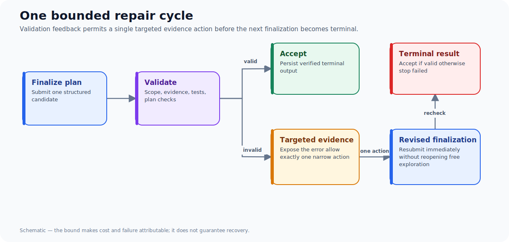
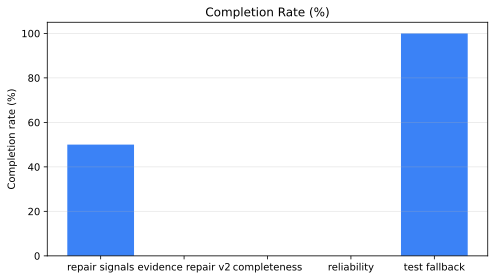
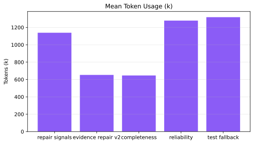

Rejecting an invalid agent plan without feedback turns validation into a dead end. Allowing unlimited retries turns it into a cost and loop-control problem. A bounded repair loop sits between those failures: expose the validator's reason, allow one targeted evidence action, then require a revised finalization.

The boundary matters. It makes both the model's behaviour and the system's cost auditable.

## The minimal protocol

1. Attempt `finalize_plan`.
2. Validate required scope, evidence, tests, and plan-level checks.
3. If validation fails, preserve the errors in the observation.
4. Permit exactly one targeted evidence action.
5. Require the next action to be a revised finalization.
6. Terminalize if that revision remains invalid.

The protocol does not guarantee that the model repairs the plan. It guarantees that a failure is finite, attributable, and measurable.

## What the cohorts say

| Cohort | Completion | Validation failures | Repairs | Successful repairs | Mean post-finalize calls |
| --- | ---: | ---: | ---: | ---: | ---: |
| Repair signals | 50% | 3 | 3 | 2 | 2.5 |
| Evidence repair v2 | 0% | 2 | 1 | 1 | 1.0 |
| Completeness guidance | 0% | 2 | 1 | 1 | 1.5 |
| Reliability validation | 0% | 4 | 2 | 2 | 2.5 |
| Test-repair fallback | 100% | 1 | 1 | 1 | 1.5 |

The result is deliberately uncomfortable: a repair action can be recorded as successful while the run still fails. In the reliability cohort, both allowed repair actions completed, yet both repeats ended with missing or nonexistent test references. The observation succeeded; the revised plan did not.

That is why a repair dashboard needs at least three separate measures: repair action success, repaired-finalization success, and terminal run success.

## Worked example: empty test discovery

The hardest observed failure was a rejected test reference followed by `related_tests` returning no matching files. A vague instruction to “find the right test” leaves the model with two bad options: omit the test field or invent an existing path.

The valid strict-plan fallback is precise: choose one exact planned test path within the task's allowed scope, place the same path in both `tests` and `expected_files`, and resubmit. The final fallback cohort completed both repeats, with 22 of 22 grounding claims verified and one successful repair.

That is encouraging non-regression evidence, not decisive mechanism proof. Neither repeat re-triggered the exact nonexistent-test validation branch after the fallback was introduced. A unit test covers the directive; a deterministic live benchmark still needs to force the branch.

## Failure taxonomy should drive the next action

| Error type | Useful recovery | Bad recovery |
| --- | --- | --- |
| Missing evidence | Read the named implementation branch | Add generic prose |
| Missing tests | Discover related tests or declare planned output | Leave tests empty |
| Nonexistent test | Replace with real test or declared planned test | Invent another path |
| Missing acceptance checks | Re-read task acceptance | Search unrelated code |
| Transport failure | Retry the same completion within a limit | Treat it as a semantic repair |

This table is a design guide, not a claim that the current model follows every path reliably. The evidence bundle in `data/` records the cohorts that motivated it.

## Counterfactual: why not allow more repair actions?

More actions can improve a genuinely under-explored plan. They also allow the model to spend unbounded tokens circling a validator error or to hide a weak plan behind repeated unrelated reads. The right counterfactual experiment is not “one action versus infinity.” Compare one, two, and three repair actions on a pre-specified failure taxonomy, while holding task, model, budget, and acceptance policy constant.

Until that exists, one bounded action is a useful safety default because it makes failure legible.

## Cohort results at a glance

## Takeaways

- Treat a repair action as an event, not proof of recovery.
- Tie repair metrics to the next finalization and terminal outcome.
- Make error categories select a narrow evidence action.
- Use deterministic branch-forcing benchmarks before attributing a later cohort's success to a repair prompt.

For the measurement framework around these loops, read [Benchmarking Agent Systems Beyond “Did It Finish?”](/blog/benchmarking-agent-repair-loops/).
