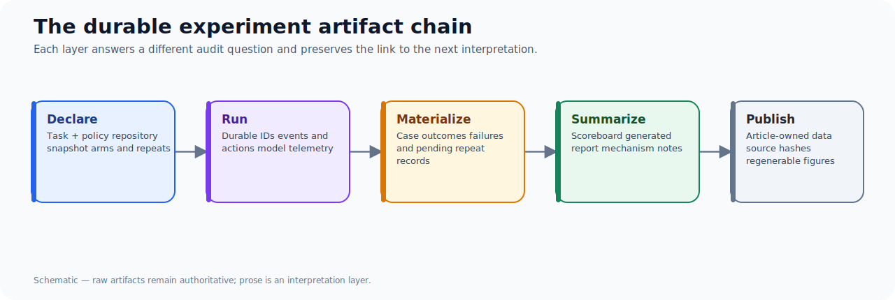
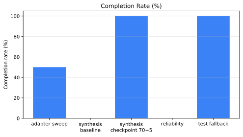
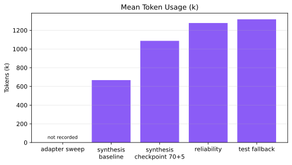

An agent experiment is not complete when the model stops. It is complete when a later reviewer can answer: what task ran, against what repository state, with what configuration, what happened in each repeat, and why the conclusion follows.

That sounds like research hygiene. In an agent system it is also product design. A study runner that emits only a terminal score turns every failure investigation into archaeology. A runner that materializes manifests, scoreboards, reports, case results, and trajectories makes iteration cumulative.

## The artifact chain

Use a small, explicit chain for every cohort:



Each link answers a different audit question. The task and snapshot answer “what was intended?” Trajectories answer “what did the model do?” Case results answer “what happened in each repeat?” The scoreboard answers “what changed across groups?” The article bundle makes the published argument regenerable.

## Why a summary report is not enough

The indexed-planner studies expose this quickly. An adapter-axis sweep reported 50% completion across two runs. That is a useful headline and an insufficient diagnosis. The later finalization-reliability cohort reported 0% completion despite substantial work: 76.5 mean turns, four validation failures, two recorded repair actions, and about 1.28 million mean tokens. The fallback cohort then reported 100% completion, 22/22 verified grounding claims, and one successful repair.

| Cohort | Completion | Mean tokens | Mean turns | Validation failures | Repair actions |
| --- | ---: | ---: | ---: | ---: | ---: |
| Adapter-axis sweep | 50% | 0 | 81.0 | n/a | n/a |
| Finalization reliability | 0% | 1.28m | 76.5 | 4 | 2 |
| Test-repair fallback | 100% | 1.32m | 78.0 | 1 | 1 |

The zero-token adapter-axis row is not evidence that the system was free. It reflects an observability gap that later work corrected with persisted model-invocation telemetry. The comparison is valuable precisely because the artifacts preserve that limitation rather than silently rewriting history.

## What must be materialized

At minimum, a study package should retain:

- `study.yaml` for the declared axes and repeats;
- a manifest with git coordinates, source task, arm IDs, and run IDs;
- per-case outcomes, including failed and pending arms;
- a scoreboard with completion, verification, cost, latency, grounding, and repair metrics;
- a human-readable report generated from those raw artifacts; and
- trajectories or event logs for mechanism analysis.

Do not put all of this into a single prose report. The report is an interpretation layer; the case data and manifest are the audit layer.

## The article handoff is part of the system

The `authoring-research-harvest` workflow turns selected study artifacts into three article-owned files:

```text
data/study-metrics.csv
data/study-cases.csv
data/evidence-manifest.yaml
```

The manifest records the source artifacts and their SHA-256 hashes. This avoids two common failures: numbers copied from a transient console, and a chart whose underlying data cannot be found once the experiment workspace changes.

## Counterfactual: when can a notebook be enough?

For a one-off exploratory question, a notebook plus an archived dataset may be sufficient. The threshold changes when a result will alter agent policy, spend budget repeatedly, or become a public claim. At that point, the experiment needs stable identities, repeat-level results, and provenance.

The falsifier is operational: if a new engineer can reconstruct the exact cohort and explain a surprising case from the report alone, the extra artifacts may be unnecessary. In practice, model failures, transport errors, and partial repairs make that rare.


## Cohort results at a glance





## Takeaways

- Treat manifests and case records as product outputs, not debugging leftovers.
- Preserve failures; they often explain an apparent improvement.
- Generate prose reports from raw artifacts, not the other way around.
- Make publication consume the same durable evidence the operators use.

The companion [Benchmarking Agent Systems Beyond “Did It Finish?”](/blog/benchmarking-agent-repair-loops) explains the scorecard these artifacts should support.
