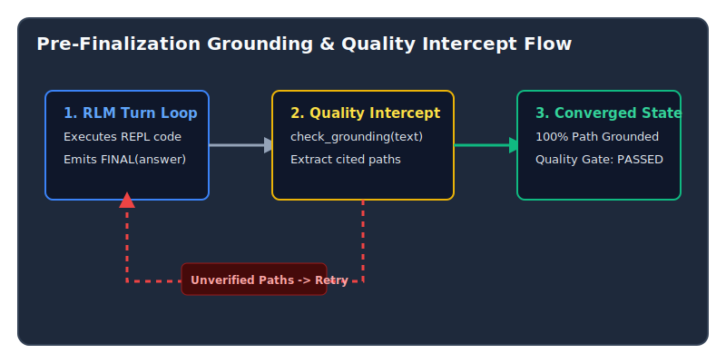

It’s easy to assume that if an AI finishes a task without crashing, it did a good job. But what if it confidently hands you a finished blueprint that cites nonexistent materials? In the world of AI agents, evaluating systems purely by whether they finish a task creates dangerous illusions of competence. An AI can execute perfectly, hit no errors, and yet submit a plan full of fabricated file paths and unverified claims.

In this study, we tested several top-tier AI models—including Gemini 3.6 and DeepSeek v4—and discovered why a 100% completion rate means nothing if the AI’s work isn't strictly "grounded" in reality. More importantly, we show how to build safeguards that force the AI to double-check its facts before submitting its final answer.

---

## The Execution vs. Quality Paradox

During matrix benchmarks, Gemini 3.6 model tiers consistently achieved **100% execution completion** (0 runtime crashes, 0 budget pauses). However, when evaluated against strict quality gates checking whether cited file paths were actually read via `view_file()` or `grep_search()`, **all provider groups failed the quality gate (`BLOCKED (0%)`)**.

| Provider Group | Completion Rate | Mean Score | Grounding Ratio | Quality Gate Status | Mean Tokens | Mean Elapsed (s) |
| :--- | :---: | :---: | :---: | :---: | :---: | :---: |
| `cliproxyapi-gemini-3.6-flash-high` | **100%** | 1.00 | 75% | **BLOCKED (0%)** | 44,080 | 222.8s |
| `cliproxyapi-gemini-3.6-flash-medium` | **100%** | 1.00 | 0% | **BLOCKED (0%)** | 17,642 | 38.0s |
| `cliproxyapi-gemini-3.6-flash-low` | **100%** | 1.00 | N/A | **BLOCKED (0%)** | 18,354 | 64.7s |
| `deepseek-v4-flash` | 33% | 0.33 | 100% | **BLOCKED (0%)** | 84,847 | 316.3s |

*Key Takeaway:* Gemini models ran fast and completed 100% of tasks, but cited file paths they had never inspected. DeepSeek achieved 100% path verification on the 33% of runs that completed, but consumed **4.8x more tokens** and hit step ceilings.

---

## Pre-Finalization Intercept & Self-Correction

To eliminate ungrounded answers without forcing full trajectory reruns, we implemented a **Pre-Finalization Quality Intercept** in our orchestration framework.



### Intercept Implementation

When a model attempts to emit `FINAL(answer)`, our orchestration framework extracts path claims and checks them against `check_grounding()`. If unverified paths are found:

```python
# orbit_harness/rlm/general/rlm.py
if grounding.unverified and grounding.claimed:
    self._self_correction_attempts += 1
    unverified_str = ", ".join(grounding.unverified[:5])
    message_history.append(
        Message(
            role="user",
            content=(
                f"[Quality Check Alert]: The plan answer contains {len(grounding.unverified)} "
                f"unverified file path(s): {unverified_str}. Execute view_file() or grep_search() "
                "to inspect and confirm these files exist before calling FINAL()."
            )
        )
    )
    final_result = None
    continue  # Allow agent to inspect missing paths
```

---

## Key Takeaways

1. **Completion Rate $\neq$ Quality:** Never rely on binary task completion as proof of model capability.
2. **Pre-Finalization Intercepts Work:** Pausing finalization to report ungrounded paths forces self-correction without wasting prior trajectory steps.
3. **Deterministic Evaluation:** Grounding ratio and required-finding checks provide unambiguous quality signals for agent benchmarks.
