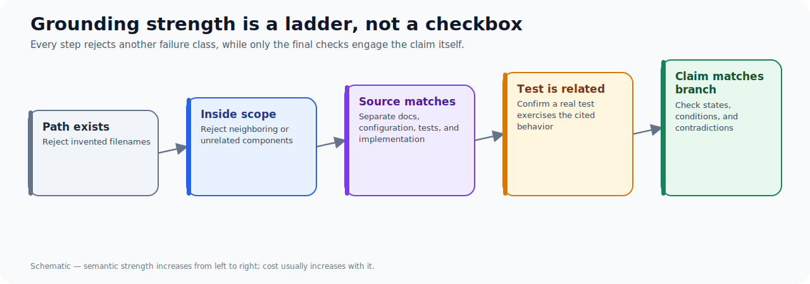
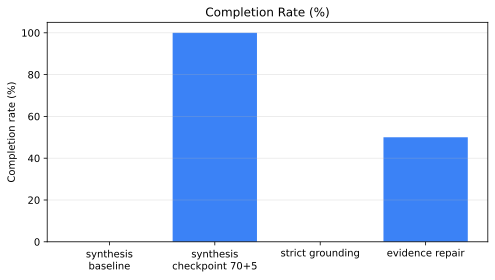
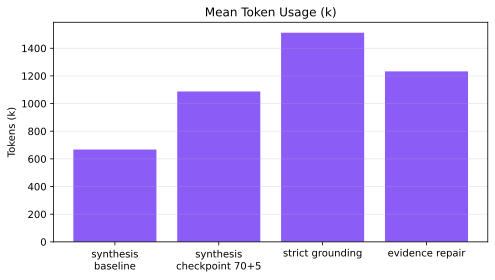

Grounding is often described as the cure for hallucinated agent plans: require the planner to cite real repository files and reject the plan when it cannot. That is necessary. It is not enough.

The key distinction is between **reference validity** and **claim validity**. A file can exist while being the wrong test, a neighbouring implementation, or documentation that describes a different execution surface. A planner that cites it has grounded a string, not necessarily an assertion.

## What strict grounding changed

The strict plan-reference cohort used the same indexed planner and a checkpoint-70-plus-five budget policy, but required each task to provide scope, evidence, and tests. It terminated at 0% completion after 77 mean iterations, approximately 1.51 million mean tokens, and 15 plan-validation failures. The error mix was evenly split across missing evidence, scope, and tests.

That is not a failure of the principle. It shows the validator was able to prevent under-specified plans from being accepted. An earlier evidence-reference repair cohort reached 50% completion, 50% verification, and 11 verified references out of 12 claimed. It demonstrates that the planner can sometimes use repair feedback to obtain real evidence.

| Cohort | Repeats | Completion | Grounding | Mean tokens | Validation failures |
| --- | ---: | ---: | ---: | ---: | ---: |
| Strict reference grounding | 1 | 0% | n/a | 1.51m | 15 |
| Evidence-reference repair | 2 | 50% | 91.7% | 1.23m | 3 |
| Checkpoint candidate | 2 | 100% | 100% | 1.09m | n/a |

The table comes from `data/study-metrics.csv`. The study manifests, scoreboards, reports, and hashes are recorded in `data/evidence-manifest.yaml`.

## The worked failure: valid files, invalid plan

Manual review of accepted checkpoint plans exposed why existence checks are only the first layer.

1. The plans cited test paths under the wrong package root; the relevant tests were under `tests/unit/...`.
2. They attributed network isolation and environment-key scrubbing to one Docker backend when the evidence belonged to different repository surfaces.
3. They presented intentional paused-state behaviour and normal success routing as failure modes.

Every example sounds plausible in a natural-language summary. None is safe to implement from. The important failure is not “the agent made up a filename.” It is “the agent assembled a claim from nearby facts without establishing the component-level relationship.”

## A hierarchy of evidence checks

| Check | Rejects | Still permits |
| --- | --- | --- |
| Path existence | Invented filenames | Wrong existing file |
| Scope membership | Files outside the task | A too-broad but in-scope citation |
| Source-type match | Documentation used as implementation evidence | Misread implementation branch |
| Related-test validation | Unrelated or nonexistent tests | A real test that does not exercise the claim |
| Claim-to-branch review | Contradictions with inspected code | Future behaviour changes |

This hierarchy suggests an implementation order: add cheap, deterministic checks early, then reserve semantic review for claims with high downstream cost. Do not attempt to solve semantic correctness by making the schema increasingly elaborate.

## Counterfactual: when path grounding is enough

Path grounding is sufficient for some narrow tasks. If a plan's only duty is to name existing files for a static inventory or migration checklist, source type and branch semantics may not matter. The moment a plan proposes a behavioural change, explains a failure mode, or chooses a test, existence becomes a weak proxy.

The falsifier for this article's claim is straightforward: show that adding existence checks alone reliably rejects the wrong-test and wrong-component examples in a held-out cohort. The current evidence does not show that; the manual review shows the opposite.

## What to add next

Three gates are high-value:

- Compare each cited test path with the repository's actual test roots and the task's declared component.
- Require implementation claims to cite implementation branches, not only security documentation or manifests.
- Add a contradiction-oriented review prompt: name the claimed wrong-state branch and the claimed recovery branch, then verify both against code.

These should complement, not replace, strict path checks. Grounding prevents a plan from floating free of the repository. Semantic review prevents it from becoming confidently wrong inside the repository.

## Cohort results at a glance

## Takeaways

- A real path is evidence of a file, not evidence of a claim.
- Grounding metrics must state their level: existence, scope, source type, or semantic support.
- Manual semantic review is expensive; use it where a plan becomes an execution contract.

Read [A Plan Can Validate and Still Be Unsafe to Implement](/blog/agent-plans-semantic-proof) for the broader readiness model.
