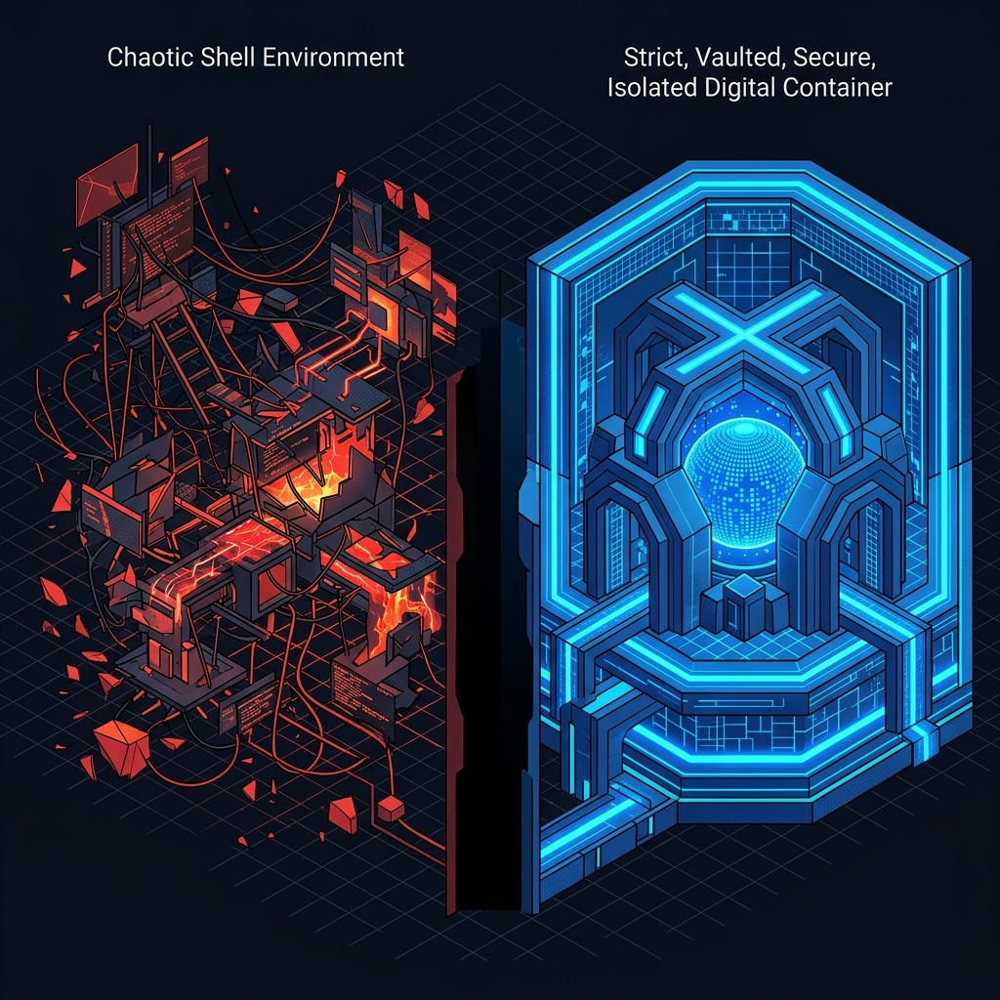

When building autonomous agents, the easiest path to giving a model "power" is to hand it a raw shell. Need to install a package? Run `pip install`. Need to find a file? Run `find / -name "*.py"`. 

It feels powerful, but in production, unconstrained shell execution is a reliability nightmare. In our orchestration framework, we discovered that soft prompt instructions ("don't delete files outside the workspace") are fundamentally incapable of preventing an agent from accidentally bricking its environment.

---

## 1. The Illusion of Prompt Security

LLMs are probabilistic. They do not natively understand the difference between `rm -rf ./tmp/` and `rm -rf /tmp/`. When an agent is confused, hallucinating, or stuck in a loop, it will try commands that seem plausible but are environmentally destructive.

In early studies, we observed agents:
- Overwriting global Python installations because they couldn't figure out virtual environments.
- Killing system processes while attempting to "free up memory."
- Entering recursive `grep` loops over `/usr/bin` that exhausted API time limits.

Prompting the model to "be careful" is not security; it's a suggestion.

---

## 2. Hard Isolation is the Only Fix

To achieve reliability, the execution boundary must be enforced by the host, not the model. This is why our orchestration framework relies on strict Docker isolation.

1. **Network Mode `none`:** Agents cannot reach out to the internet to download unverified binaries or leak data. If an agent needs a tool, it must be explicitly provisioned in the container image.
2. **Read-Only Root:** The container's root filesystem is mounted as read-only. Agents can only write to a tightly scoped `/workspace` directory.
3. **PIDs and IPC Isolation:** Agents cannot see or interact with host processes. They operate in a sterile vacuum.

---

## 3. Designing for Determinism

By removing the agent's ability to alter the global state of the machine, we force determinism. If an agent fails in a strictly isolated sandbox, we know exactly why it failed: it couldn't solve the logic problem, not because it accidentally corrupted the `apt` cache.

When building agent systems, stop treating the shell as a feature. Treat it as a vulnerability that must be ruthlessly contained.
