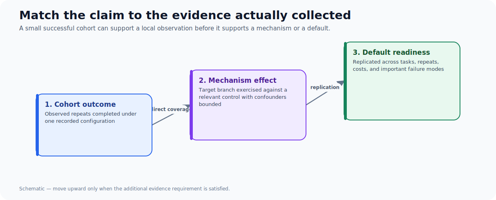
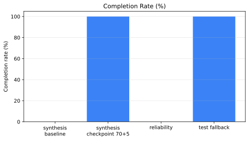
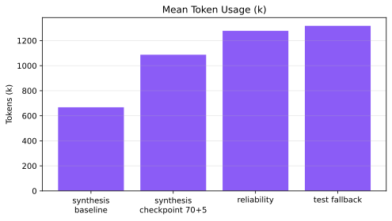

Small agent cohorts are common because each repeat can consume minutes, millions of tokens, and a full repository snapshot. The wrong response is to dismiss every two-run result. The equally wrong response is to turn 2/2 into a universal claim.

The useful move is to name the level of evidence precisely.

## Three claims that look similar but are not

| Claim | What supports it | What it does not establish |
| --- | --- | --- |
| Cohort outcome | Two runs completed under the recorded configuration | That another configuration will do the same |
| Mechanism effect | Runs exercised the intervention and differ from a relevant control | That success came from an unrelated change |
| Default-policy readiness | Replication across tasks, repeats, and failure modes | That the policy is harmless in all production contexts |

The test-repair fallback cohort completed 2/2, verified 22/22 grounding claims, and scored 1.00 in both repeats. That establishes a strong **cohort outcome**: those two recorded runs finished and passed the harness checks.

It does not directly establish the intended repair mechanism. Neither repeat re-triggered the exact rejected-test-reference branch after the fallback was introduced. The cohort is non-regression evidence for the stricter loop, not a branch-level causal demonstration.

## Compare it with the checkpoint study

The checkpoint experiment had a more suggestive mechanism contrast: baseline completed 0/2 while the checkpoint arm completed 2/2.

| Arm | Repeats | Completion | Mean tokens | Mean iterations |
| --- | ---: | ---: | ---: | ---: |
| Baseline | 2 | 0% | 667,729 | 42.5 |
| Checkpoint 70 + 5 | 2 | 100% | 1,087,231 | 67.0 |

Even here, caution is required. One checkpoint repeat finalized before the checkpoint could matter. One baseline run failed before accepting a trajectory action. The clean comparison is not “the checkpoint costs 63% more”; it is “the experiment found a 2-versus-0 completion split with heterogeneous failure mechanisms.”

## A practical interpretation template

For every small-cohort result, write four sentences before deciding what to do:

1. **Observed:** What exactly happened, with repeat count and configuration?
2. **Mechanism:** Which runs directly exercised the intervention?
3. **Confounders:** What alternative explanation or uneven failure occurred?
4. **Decision:** Keep as research-only, rerun, harden, or promote?

Applied to the fallback cohort:

- Observed: both configured repeats completed and verified.
- Mechanism: neither directly exercised the target invalid-test branch.
- Confounder: finalization error types differed from the motivating failures.
- Decision: keep the fallback, retain unit coverage, and add a deterministic branch-forcing benchmark before attributing the result to that mechanism.

That is not timid language. It is a decision that preserves a useful improvement without laundering uncertainty into a default.

## Counterfactual: when is 2/2 enough?

Two runs can be enough for a local engineering decision when the intervention is low-risk, easy to roll back, and the result is corroborated by deterministic tests. For example, keeping a prompt clarification behind a strict validator is different from changing a global production execution policy.

Two runs are not enough when the decision changes safety boundaries, cost ceilings, default model routing, or the interpretation of a public benchmark. Those need more tasks, more repeats, and explicit sensitivity analysis.

## The next experiment

The next fallback study should pre-specify the failure branch and force it: inject an invalid test reference, return zero related tests, then assert that the revised plan puts the same planned path in `tests` and `expected_files` within allowed scope. Run at least four repeats per arm against a control. Report all runs and the subset that actually reached the branch.

That experiment would not make the whole planner reliable. It would transform the current inference from “the system passed a later cohort” to “this recovery mechanism worked under its intended trigger.”

## Cohort results at a glance

## Takeaways

- 2/2 is a fact about a cohort, not a synonym for general reliability.
- Direct branch coverage is stronger than post-hoc narrative alignment.
- State confounders next to the headline, not in a footnote.
- Use small cohorts to choose the next discriminating experiment.

For the repair-loop design behind this example, see [Designing Bounded Repair Loops for Agent Plans](/blog/bounded-agent-repair-loops).
