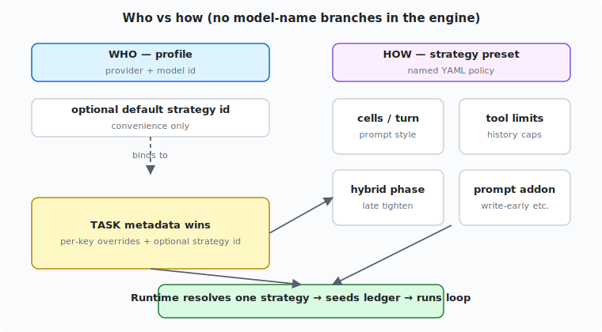
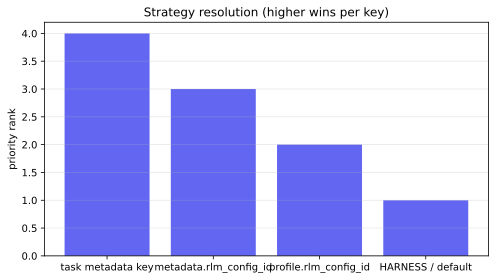
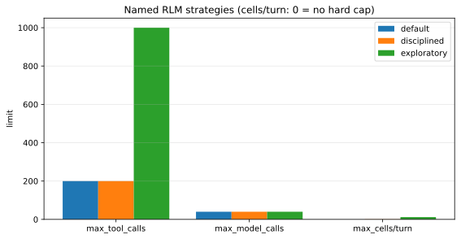

If you run more than one model through the same recursive agent loop, a single default policy will usually punish at least one of them. A multi-fence model that plans in five code blocks can burn a tool budget in a few turns; a one-cell-friendly model may look “disciplined” under the same knobs and finish cleanly. The instinctive fix — `if "vendor" in model:` inside the engine — does not age well.

**Claim.** Separate **who runs** (model profile) from **how the loop runs** (a named execution strategy). Encode strategies as data (YAML presets), bind them optionally from profiles, and let **task metadata win** on every key. Keep the runtime free of model-name branches.

This note is from live recursive-agent work in mid‑2026: multi-cell thrash on long reviews, disciplined short plans, and human-in-the-loop “extend budget” actions that did nothing because the wrong ledger row was raised. Numbers and presets below are **starting points from that dogfood**, not universal optima.

## What this article assumes

We talk about a **recursive language-model (RLM) loop**: the model proposes fenced **code cells**, a runtime executes them in a REPL, returns **observations**, and repeats until the model emits a terminal signal (`FINAL`), or a budget trips (steps, tools, model calls).


*Figure: one simplified turn. “Cell” means one executed fenced block, not a notebook metaphor only.*

You do not need our particular codebase to use the idea. Any agent stack with multi-turn tool use and more than one model personality hits the same design fork.

**Companion notes** in this series:

- [When smaller cells make agents worse](/blog/rlm-small-cells) — prompting changes cell shape; **horizon** still decides completion.
- [RLM is not automatically token-efficient](/blog/rlm-history-compaction) — history caps belong on the **same** strategy object as cell and tool limits.

## The problem: one loop, two behaviors

| Behavior | Typical model style | Failure under one-size defaults |
|----------|---------------------|----------------------------------|
| One cell / turn, converges | Single-cell-friendly | Fine near modest `max_tool_calls` |
| Many cells / turn, exploratory | Multi-fence | Burns cell/tool budget quickly; raising *root steps* alone does not help |

The useful product question is not “do we need different models?” It is: **do we need different approaches** — and can we change approaches without forking the engine?

## Architecture: who vs how

| Axis | Config surface | Meaning |
|------|----------------|---------|
| **Who** | Profile registry (`profiles.yaml`) | Provider + model id (+ optional default strategy id) |
| **How** | Strategy registry (`rlm_config.yaml`) | Iterations, tool/model caps, cells/turn, prompt style, history, addons |



*Figure: profiles point at strategies; tasks can override either the whole preset or individual keys. The runtime never branches on the model string.*

### Resolution order (highest wins **per key**)

```text
task.metadata[key]
  >  task.metadata.rlm_config_id  (named preset)
  >  profile.rlm_config_id        (convenience default)
  >  AGENT_RLM_CONFIG / "default"
```



*Figure: rank only — a task key always beats a profile-bound preset for that key.*

### Why not model `if`s

1. **New models appear constantly.** Engine forks rot.
2. **Same model, different jobs.** A short probe may want multi-block batching; a long review may want hybrid late discipline ([cell A/B](/blog/rlm-small-cells)).
3. **Evals need pure strategy diffs** without swapping weights.
4. **Operators** should add presets without shipping Python.

## Named presets (illustrative shape)

| Preset | Intent | Typical binding |
|--------|--------|-----------------|
| `default` | Conservative shared baseline | env / fallback |
| `disciplined` | One-cell-friendly, tighter output | single-cell-oriented profiles |
| `exploratory` | High tool headroom, multi-cell OK, hybrid late phase, write-early nudge | multi-fence profiles |



*Figure: `max_cells/turn` of 0 means **no hard cap** (`null` in config) for `default`.*

```yaml
# rlm_config.yaml (abridged)
configs:
  default:
    max_tool_calls: 200
    max_model_calls: 40
    max_code_blocks_per_turn: null
    prompt_style: multi_block
    history_keep_recent_turns: 6
    history_max_total_chars: 80000

  disciplined:
    max_tool_calls: 200
    max_code_blocks_per_turn: 1
    prompt_style: single_block
    history_max_total_chars: 60000

  exploratory:
    max_tool_calls: 1000
    max_code_blocks_per_turn: 12
    hybrid_switch_after_turns: 3
    late_max_code_blocks_per_turn: 4
    prompt_style: multi_block_budgeted
    system_prompt_addon: >-
      Prefer batched reads; write findings early under a reviews path;
      after orientation, fewer smaller cells and FINAL soon.
```

```yaml
# profiles.yaml (bindings)
single-cell-model:
  provider: gateway
  model: vendor/single-cell-model
  rlm_config_id: disciplined

multi-fence-model:
  provider: gateway
  model: vendor/multi-fence-model
  rlm_config_id: exploratory
```

Task authors still win:

```yaml
agent:
  profile: multi-fence-model
metadata:
  rlm_config_id: disciplined   # force a different approach
  max_tool_calls: 500          # one-off key override
```

## Knobs that earned a place

| Knob | Why it showed up in practice |
|------|------------------------------|
| `max_tool_calls` / `max_model_calls` | Real stop reasons; must seed a **ledger** so “extend budget” raises the limit that actually fired |
| `max_code_blocks_per_turn` | Soft prompt styles leak on turn 0; the runtime can execute the first N and note deferred cells |
| `prompt_style` | `single_block` / `multi_block` / `multi_block_budgeted` as **data**, not forked system prompts |
| `system_prompt_addon` | Write-early and “budget is finite” steers without new code paths |
| Hybrid late phase | Explore with a higher cell cap, then tighten (long multi-fence reviews) |
| History working set | Stops input escalators ([token note](/blog/rlm-history-compaction)) |

### Ledger honesty (operations)

A recurring failure mode: the runtime stops on **`max_tool_calls`**, a human “extends budget” by raising **root steps** or an unset ledger row, and warm-continue changes nothing useful.

Strategy work is operationally real only when:

1. Limits from the resolved strategy are **seeded** on the budget ledger (not left `None`).
2. Actual tool/model counts are **settled** each invocation.
3. Warm-continue **grants remaining** against the raised ceiling.
4. Gates surface **`exhaustion_reason`** so operators know which knob tripped.

Without that, “exploratory with 1000 tool calls” is a paper policy.

## Worked scenarios

**A — short multi-fence probe.** Default `exploratory` may be wrong: multi-block batching can still finish under a short step budget (see the [A/B note](/blog/rlm-small-cells)). If you force `disciplined` for measurement, treat **completion risk** as part of the experiment, not a surprise.

**B — long multi-fence review.** Profile default `exploratory` gives tool headroom, hybrid late nudge, and history caps. If you see `exhaustion_reason=max_tool_calls`, extend the **tool** budget — not steps alone.

**C — single-cell-friendly implement.** Profile `disciplined` keeps one-cell cadence; the task can still raise `max_iterations` without rewriting engine code.

## Counterfactuals

1. **If one global default were enough,** multi-fence multi-cell burn and single-cell success would both be well-served by something like `max_tool_calls≈100` and multi-block prompts. Live runs showed they are not.

2. **Auto-tune from telemetry** is a different product. It still needs a strategy representation like this YAML; it does not remove the who/how split.

3. **Per-provider adapter forks** multiply code paths and fight “same stack, many models.”

4. **Falsifier for this architecture:** a required behavior that cannot be expressed as strategy keys without reading `model` in the engine. None appeared in this design pass for cell caps, prompts, history, or budgets.

## Limitations

- Preset numbers (`1000` tools, `12` cells, hybrid after 3) are **starting points**, not optimized frontiers.
- Profile → strategy binding is a **convenience**; a mis-bound profile silently changes cost envelopes — snapshot defaults with each run.
- Hard cell caps can surprise models that planned later fences; deferred-cell messaging must stay explicit.
- This article does **not** claim hybrid + compaction **fixed deliverable writes**; token and cell behavior improved while write thrash could remain ([token note](/blog/rlm-history-compaction)).

## Takeaways

1. Split **who** (profile) from **how** (strategy preset).
2. Encode approaches in **data**; resolve with a clear override stack; **never** branch the engine on model id strings.
3. Put every enforced limit on the **ledger**, or human “extend” actions will lie.
4. Keep **history** and **cell** policy on the same strategy object — they interact with tool budgets.
5. Use task metadata when the job’s horizon disagrees with the model’s default personality ([smaller cells](/blog/rlm-small-cells)).
