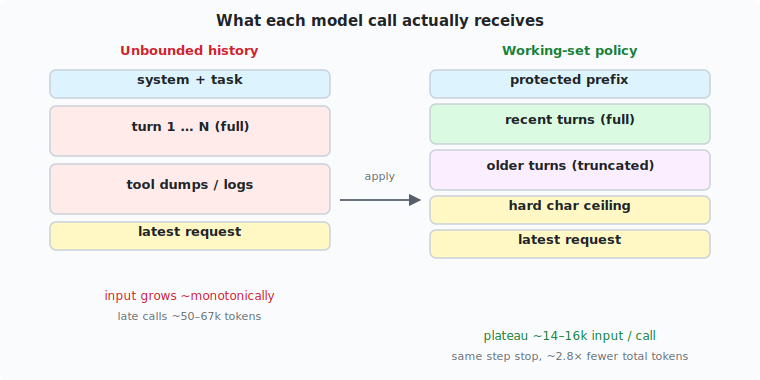
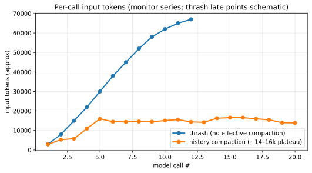
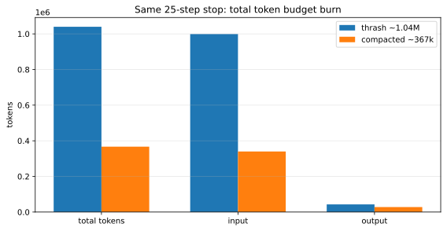

Recursive agent loops are often sold as a way to *work longer without stuffing the whole world into one prompt*. That can be true for **task structure**. It is **false by default** for **token cost**.

If every model call re-sends a growing dialog of tool traces and observations, **input tokens climb nearly monotonically**. Efficiency is a **history policy**, not a free property of “being recursive.”

**Evidence (directional, mid‑2026 dogfood, multi-fence model, security-review style runs):** with history compaction, per-call input **plateaued around 14–16k** instead of climbing toward **~50–67k**, and total tokens for a **25-step stop** fell from **~1.04M to ~367k** (about **2.8×**). The cheaper run still **did not** produce the review file.

So this note is about **what you measure** and **what you ship as knobs** — not a claim that compaction finishes the job.

## Quick vocabulary

| Term | Meaning here |
|------|----------------|
| **RLM loop** | Model proposes code → runtime executes **cells** → observations return → repeat |
| **Cell** | One fenced code block executed in the REPL |
| **Per-call input** | Tokens in the *next* model request (usually dominated by history) |
| **Working set** | The subset of history you deliberately keep full-fidelity |


*Figure: history sits on the path into every model call; without a policy it grows each turn.*

**Related reading:**

- [When smaller cells make agents worse](/blog/rlm-small-cells) — cell policy ≠ completion.
- [Strategies, not model ifs](/blog/rlm-execution-strategies) — history caps live on named presets next to cell/tool budgets.

## Three confusions worth separating

Operators watching live runs often ask: *why are tokens climbing? Isn’t recursion supposed to be efficient? Should we chart input and output separately?*

Those questions mix:

1. **Recursion depth** (nested sub-calls) vs **dialog length** at one depth.
2. **Total tokens** vs **per-call input** (the quantity that makes each step more expensive).
3. **Efficiency of reasoning** vs **efficiency of memory encoding**.

This article focuses on (2) and (3).

## What unbounded history looks like

Without a working-set policy, each turn appends assistant prose, tool dumps, errors, logs, and scaffolding. The next call’s **input** includes most of that. **Output** may stay modest while **input** becomes the bill.



*Figure: compaction does not delete the task; it caps what re-enters the next prompt.*

**Observation — thrash run:** late calls approached **~50–67k input tokens**; cumulative total near a 25-step stop was on the order of **~1.04M** (~999k in / ~43k out).

**Observation — compaction re-run:** after an early climb, per-call input **held ~14–16k** (series ending near `12867, 16272, 13357, 16672, 13710, 13882, 14010`); cumulative **~367k** (~340k in / ~28k out) at the same step ceiling.



*Figure: thrash late points are schematic midpoints from monitor notes (not a full exported series); compacted series follows the live plateau. Use for **shape**, not millimetric accuracy.*



*Figure: same stop condition, very different bill — driven by input.*

## Core argument

### 1. Recursive efficiency is a policy surface

A loop gives you places to intervene **before** each model call:

| Knob (strategy config) | Role |
|------------------------|------|
| `history_keep_recent_turns` | Full-fidelity recent window |
| `history_max_chars_per_old_message` | Truncate older turns |
| `history_max_total_chars` | Hard working-set ceiling |
| `history_protect_prefix_messages` | Keep system/task head intact |
| `max_observation_chars` | Bound a single tool result |

These belong on the **same strategy object** as cell and tool budgets ([strategies](/blog/rlm-execution-strategies)).

**Inference:** if you ship recursive agents with unbounded dialog concatenation, you have built a **linear input escalator**, not an efficient long-horizon system.

### 2. Report input and output separately

Totals hide the failure mode:

| View | What you miss |
|------|----------------|
| Total only | Whether cost is “thinking” or “re-reading” |
| Output only | Looks fine while input explodes |
| Input per call | Shows plateau vs climb — the health metric |

Live monitors should treat **last-call input** and **history size under budget** as first-class series.

### 3. Token wins do not imply task wins

The compacted run was **~2.8× cheaper** — yet stopped at **25/25 steps** with **no FINAL** and no deliverable file. Notes showed the model stuck on **write mechanics** (parse errors, chunked writes, shell heredocs) while input stayed flat.

Compaction fixed the **right bottleneck for the token question** and the **wrong bottleneck for “please finish the review.”** Both can be true at once.

## Worked example: reading a monitor line

Healthy compacted turn (illustrative):

```text
turn 14  in≈16.3k  out≈1.5k  hist_chars≈51k/64k  tools 36/1000  file? no
```

Checklist:

1. **in flat** → memory policy holding.
2. **out modest** → not dumping the whole report into chat.
3. **file? no** after many “about to write” turns → success is still red; **do not extend the step budget assuming tokens are the issue.**

Thrash contrast:

```text
turn 14  in≈55k+  out≈2k  hist growing  tools climbing  file? no
```

Here, prioritize **history policy and re-scan behavior**, not only more steps.

## Counterfactuals

1. **If RLM were token-efficient by construction,** per-call input would stay roughly constant as turns increase under a fixed task. The thrash series falsifies that for an uncompacted dialog loop.

2. **Alternative to truncation:** externalize state into the workspace (files, variables) and keep dialog thin by design. Compaction is a **runtime** mitigation when the model keeps stuffing observations into chat history.

3. **Aggressive summarization** of old turns might save more tokens but can erase error strings needed to stop write thrash — a different tradeoff, not measured here.

4. **What would reverse the ~2.8× win?** Disable history caps with the same model and task length; expect totals back toward thrash order-of-magnitude. **Provisional** without a controlled re-disable A/B on identical seeds.

## Limitations

- Thrash late-call series in the figure is **reconstructed from monitor narrative**, not a full CSV export.
- Both runs hit a **step ceiling without deliverable**; token comparison is for **same stop**, not same success.
- Compaction parameters were those of the strategy in flight that day — not a full grid search.
- Nested recursion depth is not measured separately from root dialog length.
- Write-path failures deserve their own note; they are only a boundary condition here.

## Takeaways

1. **Assume dialog RLM will grow input until you stop it.** Ship working-set knobs on day one.
2. **Dashboard in and out separately**; watch per-call input plateau.
3. **Token health ≠ task health.** Pair token series with artifact checks (file exists, `FINAL`, verify score).
4. **Bind history caps with cell/tool budgets** on one strategy object — see [strategies](/blog/rlm-execution-strategies).
5. **Next measurement:** export full per-call in/out series so figures need no schematic fill.
