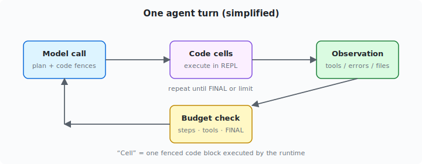
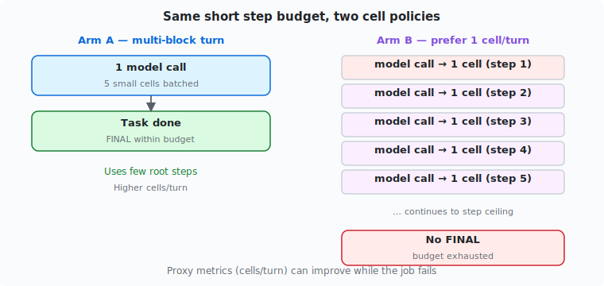

Making an agent emit *smaller, fewer code cells per turn* sounds like pure upside: tighter discipline, less thrash, easier observations. Sometimes it is. Sometimes it is how you fail a short task while your dashboards look healthier.

**Claim.** In a controlled multi-fence-model A/B on a recursive agent stack, prompting for smaller cells improved **cell shape** and hurt **task completion** under a short root-step budget. Cell aesthetics are a **diagnostic**, not a success metric. Match cell policy to **horizon**.

This is a research note from mid‑2026 dogfooding (**n = 1** clean comparable pair). Treat effect sizes as **directional**, not population estimates. It is not a claim about all models or all task lengths.

## Background: cells in a recursive loop

The runtime drives a simple cycle: the model emits fenced Python **cells**, the environment executes them, observations return, and the loop continues until `FINAL`, budget exhaustion, or a human pause.

*Figure: each “model call → cells → observation” cycle typically costs one root step. Batching work into one multi-cell turn can be the efficient encoding of a short plan.*

Models differ wildly in how many fences they emit per call:

- **Single-cell-friendly** models often converge with one-cell-ish turns.
- **Multi-fence** models under default multi-block prompting often dump many fences in one response.

A natural reaction is: *prompt the model to prefer smaller cells.* We tested that **with prompting only** — no hard `max_code_blocks_per_turn` — on a short plan-mode container security probe (**10** root steps, **50** tool calls).

**Series companions:**

- [RLM is not automatically token-efficient](/blog/rlm-history-compaction) — when the cost problem is *input growth*, not cell count.
- [Strategies, not model ifs](/blog/rlm-execution-strategies) — why cell policy should be a selectable strategy, not a global moral.

## Architecture of the failure mode

Under a fixed step ceiling, multi-block batching and single-cell discipline use the budget differently:

*Figure: Arm A finishes inside the budget; Arm B spends steps on per-cell model rounds and hits the wall without `FINAL`.*

## Experimental setup

| Arm | Run id | `prompt_style` | Extra |
|-----|--------|----------------|--------|
| **A baseline** | `run-a-baseline` | `multi_block` | none |
| **B small-cell** | `run-b-smallcell` | `single_block` | system addon: prefer ≤1 short cell/turn |

Same task family, same multi-fence model family; the difference is **prompting**.

**Footnote (provisional):** the first B attempt failed on a container-daemon race while another run shared the host runtime; metrics below are from a clean re-run.

## Results

| Metric | A baseline | B small-cell | Δ (B−A) |
|--------|------------:|-------------:|--------:|
| Outcome | completed / FINAL | blocked (10 steps, no FINAL) | — |
| Iterations | 1 | 10 | +9 |
| Total cells | 5 | 15 | +10 |
| Cells/turn mean | **5.0** | **1.5** | **−3.5** |
| Cells/turn max | 5 | 6 | +1 |
| Cells/turn series | `[5]` | `[6,1,1,1,1,1,1,1,1,1]` | — |
| Code chars mean | 299 | **92** | **−207** |
| Code chars median | 318 | **64** | — |

*Figure: mixed-unit grouped bars — compare bars **within** each metric, not across metrics.*

*Figure: A reached FINAL; B did not under the same step ceiling.*

### What the cell series shows

After turn 0, arm B stayed at **one cell per turn for nine turns**. Mean cell text was roughly **3× shorter**. Prompting *did* change behavior.

*Figure: sticky multi-fence open (6), then disciplined single-cell turns — and still no FINAL by step 10.*

## Core argument

### 1. Cell discipline is not the objective function

Arm B optimized proxies operators like (cells/turn, code length). Arm A optimized what the eval scored: **finish the short probe**.

On a **10-step** budget, a multi-block turn with five related micro-reads can be the efficient encoding of “one planning step.” Forcing one micro-step per model call multiplies **model rounds** — each with latency and fixed overhead — until the step ledger hits the wall.

### 2. The first turn is sticky

Even with `single_block` + “prefer one short cell,” B still opened with **six fences once**. Soft guidance is not a hard guarantee on an opening plan dump. If the risk is “turn 0 burns the tool budget,” **prompting alone is insufficient** — you need engine caps or deferred-cell policy ([strategies](/blog/rlm-execution-strategies)).

### 3. When smaller cells *are* the right medicine

The same period’s longer multi-fence review thrash showed the opposite failure mode: many cells, re-scans, tool-budget blowups, no deliverable. There, smaller cells (or hybrid late-phase caps) target **long-horizon thrash**, not a 10-step probe.

**Labeled inference:** short probes often reward batching; long exploratory reviews may reward turn discipline + write-early pressure. Collapsing both into “always small cells” is a design error.

## Worked example: reading the dashboard

| Dashboard signal | B looks… | Actual task outcome |
|------------------|----------|---------------------|
| Cells/turn | excellent | blocked |
| Code chars | excellent | blocked |
| Iterations used | “working hard” | exhausted |
| FINAL / artifact | — | missing |

Without an **outcome column** (`FINAL`, files changed, verify score), B wins a beauty contest and loses the job.

## Counterfactuals

1. **If “smaller cells always help” were true,** B should match or beat A on completion under the same budgets. It did not here — falsifying the **universal** form of the claim for this setup.

2. **Alternative explanation:** not cell size, but *slower exploration* under a hard step cap. More steps might let B finish — that is a **different experiment**, not a free rescue of the universal claim.

3. **Hard cap counterfactual:** set `max_code_blocks_per_turn: 1` in the runtime instead of prompting. Expect less first-turn leakage; completion still depends on step budget. Not run in this A/B (prompt-only by design).

4. **Long-horizon counterfactual:** re-run with 40+ steps and an artifact success metric. Prediction: B or hybrid may dominate if A thrash-burns tools early. **Provisional** until re-run.

## Limitations

- **n = 1** clean pair (plus one failed B attempt). Directional only.
- **Prompt-only** intervention; engine cell caps and hybrid schedules are out of scope for these numbers.
- Task is a **short plan-mode probe**, not a full review deliverable.
- One multi-fence profile; do not export to “all multi-fence models” without replication.
- Token thrash metrics live in the [companion token article](/blog/rlm-history-compaction); do not mix those totals into this A/B.

## Takeaways

1. **Measure completion, not only cell aesthetics.**
2. **Match cell policy to horizon.** Short step budgets can make multi-block batching *more* efficient.
3. **Prompting moves means; it does not seal turn 0.** For guarantees, use strategy knobs (`max_code_blocks_per_turn`, hybrid late phase) in [strategies](/blog/rlm-execution-strategies).
4. **Next experiment:** same A/B with artifact success + longer step budget; report cells/turn *and* FINAL *and* tokens in/out.
