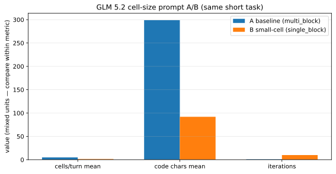
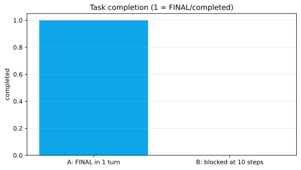
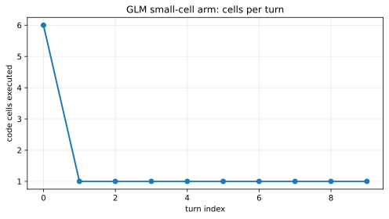

**Thesis.** Making an agent emit *smaller, fewer code cells per turn* is often treated as an unalloyed good — tighter discipline, less thrash, easier observation. In a controlled multi-fence-model A/B on a recursive agent stack, that intuition held for **cell shape** and failed for **task completion** under a short root-step budget.

This is a research note from live recursive-RLM dogfooding (2026-07-17), not a claim about all models or all task lengths.

## Context

The stack drives agents through a recursive REPL loop: the model emits fenced Python “cells,” the runtime executes them, returns observations, and continues until `FINAL`, budget exhaustion, or HITL pause. Models differ wildly in how many fences they emit per call.

- **Single-cell-friendly models** often converged with one-cell-ish turns.
- **Multi-fence models** under default multi-block prompting often dump many fences in a single response.

A natural operator reaction is: *prompt the model to prefer smaller cells.* We tested that **with prompting only** — no hard `max_code_blocks_per_turn` — on a short plan-mode container security probe (10 root steps, 50 tool calls).

Related pieces in this series:

- [RLM token efficiency and history compaction](/blog/rlm-history-compaction) — when the cost problem is *input growth*, not cell count.
- [Strategies, not model `if`s](/blog/rlm-execution-strategies) — why cell policy should be a selectable strategy, not a global moral.

## Experimental setup

| Arm | Run ID | `prompt_style` | Extra |
|-----|--------|----------------|--------|
| **A baseline** | `run-a-baseline` | `multi_block` | none |
| **B small-cell** | `run-b-smallcell` | `single_block` | system addon: prefer ≤1 short cell/turn |

Same task fixture family, same multi-fence model family, difference is **prompting**.

**Operational footnote (provisional for interpretation):** the first B attempt failed with a container-daemon race while another run shared the host runtime; the reported B metrics are from a clean re-run.

## Results

| Metric | A baseline | B small-cell | Δ (B−A) |
|--------|------------:|-------------:|--------:|
| Outcome | completed / FINAL | blocked (hit 10 steps, no FINAL) | — |
| Iterations | 1 | 10 | +9 |
| Total cells | 5 | 15 | +10 |
| Cells/turn mean | **5.0** | **1.5** | **−3.5** |
| Cells/turn max | 5 | 6 | +1 |
| Cells/turn series | `[5]` | `[6,1,1,1,1,1,1,1,1,1]` | — |
| Code chars mean | 299 | **92** | **−207** |
| Code chars median | 318 | **64** | — |

*Figure: mixed-unit grouped bars — compare bars **within** each metric, not across metrics.*

*Figure: A reached FINAL; B did not under the same step ceiling.*

### What the cell series shows

After turn 0, arm B stayed at **one cell per turn for nine turns**. Mean cell text was roughly **3× shorter**. Prompting *did* change behavior.

*Figure: sticky multi-fence open (6), then disciplined single-cell turns — and still no FINAL by step 10.*

## Core argument

### 1. Cell discipline is not the objective function

Arm B optimized a *proxy* operators care about (cells/turn, code length). Arm A optimized what the eval actually scored: **finish the short probe**.

On a **10-step** budget, a multi-block turn that does five related micro-reads/writes can be the efficient encoding of “one planning step.” Forcing one micro-step per model call multiplies **model rounds**, each with its own latency and fixed overhead, until the step ledger hits the wall.

### 2. The first turn is sticky

Even with `single_block` + “prefer one short cell,” B still opened with **six fences once**. System-style guidance is not a hard guarantee on the opening multi-step plan dump. If your risk is “turn 0 burns the tool budget,” **prompting alone is insufficient** — you need engine caps or deferred-cell policies (see the [strategies article](/blog/rlm-execution-strategies)).

### 3. When smaller cells *are* the right medicine

The same session’s longer multi-fence security-review thrash suggested the opposite failure mode: many cells, re-scans, and tool-budget blowups without a deliverable. There, smaller cells (or hybrid late-phase caps) are aimed at **reducing thrash over long horizons**, not at winning a 10-step probe.

**Inference (labeled):** short probes reward batching; long exploratory reviews may reward turn discipline + write-early pressure. Collapsing both into “always small cells” is a design error.

## Worked example (operator reading)

Suppose you only look at dashboards:

| Dashboard signal | B looks… | Actual task outcome |
|------------------|----------|---------------------|
| Cells/turn | excellent | blocked |
| Code chars | excellent | blocked |
| Iterations used | “working hard” | exhausted |
| FINAL / artifact | — | missing |

Without an **outcome column** (FINAL, `files_changed`, verify score), B would win a beauty contest and lose the job.

## Counterfactuals and alternatives

1. **If the claim “smaller cells always help” were true,** B should match or beat A on completion under the same budgets. It did not on this short task. That falsifies the universal form of the claim for this setup.

2. **Alternative explanation for B’s failure:** not cell size, but *slower exploration* under a hard step cap. A soft time/token budget with more steps might let B finish — then small cells would look neutral or positive. That is a **different experiment**, not a rescue of the universal claim without new data.

3. **Hard cap counterfactual:** set `max_code_blocks_per_turn: 1` in the engine (disciplined strategy) instead of prompting. Expect even less first-turn leakage; completion effect still depends on step budget. Not run in the published A/B (prompt-only by design).

4. **Long-horizon counterfactual:** re-run A/B with 40+ steps and an artifact-based success metric (`reviews/*.md` exists). Prediction from session notes: B or hybrid may dominate A if A thrash-burns tools early. **Provisional** until re-run.

## Limitations

- **n = 1 pair** of successful comparable runs (plus one container-daemon-failed B attempt). Treat effect sizes as **directional**, not population estimates.
- **Prompt-only** intervention; engine cell caps and hybrid schedules are out of scope for this note’s numbers.
- Task is a **short plan-mode probe**, not a full security review deliverable.
- Model: one multi-fence profile; do not export conclusions to “all multi-fence models” without replication.
- Metrics for thrash vs compaction live in the [companion token article](/blog/rlm-history-compaction); do not mix those totals into this A/B.

## Takeaways

1. **Measure completion, not only cell aesthetics.** Cells/turn is a diagnostic, not a success metric.
2. **Match cell policy to horizon.** Short step budgets can make multi-block batching *more* efficient.
3. **Prompting moves means; it does not seal turn 0.** For hard guarantees, use strategy knobs (`max_code_blocks_per_turn`, hybrid late phase) described in the [strategies article](/blog/rlm-execution-strategies).
4. **Next experiment worth running:** same A/B with artifact success + longer step budget; report cells/turn *and* FINAL *and* tokens in/out.
