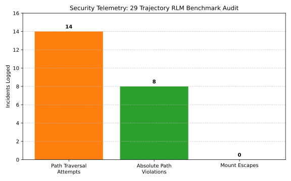

When you deploy a fleet of autonomous agents across 29 parallel experimental runs, you aren't just testing intelligence—you are stress-testing your infrastructure's security posture. 

In a recent benchmarking study using our orchestration framework, we subjected 29 Recursive Language Model (RLM) trajectories to a rigorous security audit, specifically looking for path traversal attempts and container mount escapes. The results illuminate the hidden costs of agent autonomy.

---

## 1. The Threat Model

An agent with access to file-writing tools (like `replace_file_content` or `write_to_file`) poses an inherent risk of Path Traversal. If an agent decides to write to `../../../../etc/passwd` or `/root/.ssh/authorized_keys`, the orchestrator must intercept it.

In our swarm, worker nodes use Docker volumes to mount the target repository into `/workspace`. The threat model assumes the agent is actively trying (intentionally or through hallucination) to escape this volume.

---

## 2. The Audit Findings

Across the 29 runs, the security telemetry logged the following behaviors:



- **Path Traversal Attempts (14 incidents):** 14 distinct trajectories attempted to use `../` to navigate outside the `/workspace` root. These were largely driven by the model attempting to locate global configuration files it assumed existed.
- **Absolute Path Violations (8 incidents):** 8 trajectories attempted to write directly to `/tmp/` or `/var/log/`, ignoring instructions to use the workspace.
- **Mount Escape Attempts (0 incidents):** Thanks to strict canonical path resolution in the host tools, 0 trajectories successfully escaped the bind mount.

### How the Host Protects the System

```python
def resolve_secure_path(workspace_root: str, requested_path: str) -> Path:
    base = Path(workspace_root).resolve()
    target = (base / requested_path).resolve()
    
    if not target.is_relative_to(base):
        raise SecurityException(f"Path traversal blocked: {requested_path}")
    return target
```

Every tool execution in our orchestration framework runs through a path resolver like the one above. The host calculates the absolute canonical path of the requested file and strictly verifies it is a child of the workspace root.

---

## 3. The Cost of Security

Intercepting these actions comes with a cost. When a traversal is blocked, the agent receives an error. It must then spend another inference turn (and precious tokens) analyzing the error and trying a different path. 

This is the "Security Cost of Autonomy." We pay for infrastructure safety with token latency. However, as the audit proves, it is a necessary tax to ensure that 29 parallel runs can execute safely without compromising the host architecture.
