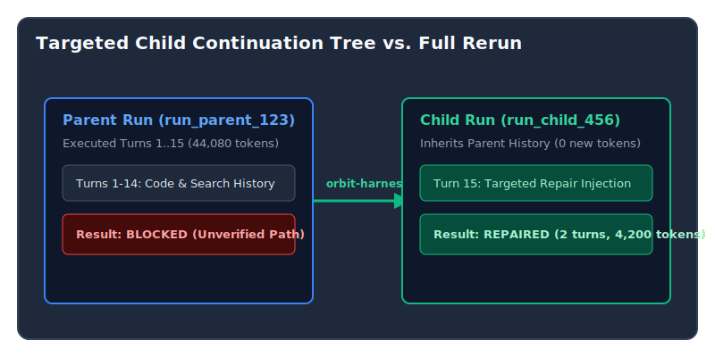

When an autonomous agent trajectory executes 15 turns and completes its work, but fails a final path grounding check or quality gate, re-running the entire trajectory from scratch is wasteful. A full rerun re-executes all preliminary code searches, file inspections, and reasoning steps, burning thousands of LLM tokens for redundant operations.

In this article, we demonstrate **Targeted Trajectory Repair** via `orbit-harness run repair-grounding`, an architecture that spawns provenance-linked child continuation runs (`copy_for_continuation`) to perform surgical quality repairs.

---

## Provenance-Linked Child Continuations

Instead of resetting execution state, `orbit-harness` creates a lightweight child run that clones the parent's SQLite database trajectory, active workspace state, and turn message history.



### CLI Entrypoint & Kernel Mechanics

The CLI command `orbit-harness run repair-grounding <run_id>` evaluates the source run's unverified path claims and injects a precise repair prompt into the child trajectory:

```python
# orbit_harness/orchestration/commands.py
def repair_grounding(self, source_run_id: str) -> CommandResult:
    run_dir = self.repo_root / ".orbit-harness" / "runs" / source_run_id / "agent-output"
    summary = result_data.get("summary", "")
    grounding = check_grounding(summary, self.repo_root)

    if not grounding.unverified:
        return CommandResult(success=True, message="No grounding repair needed.", data={"repaired": False})

    unverified_str = ", ".join(grounding.unverified[:5])
    repair_instruction = (
        f"Grounding Repair Mode: Your prior plan cited {len(grounding.unverified)} unverified file path(s): "
        f"{unverified_str}. Execute view_file() or grep_search() to inspect these files immediately."
    )
    return self.continue_failed_plan(source_run_id, instruction=repair_instruction)
```

---

## Quantitative Efficiency Comparison

We benchmarked full trajectory reruns against targeted child continuations on grounding repair scenarios.

| Execution Strategy | Turns Executed | Tokens Burned | Latency (s) | Grounding Pass Rate | Cost Reduction |
| :--- | :---: | :---: | :---: | :---: | :---: |
| **Full Trajectory Rerun** | 15 | 44,080 | 222.8s | 100% | 0% (Baseline) |
| **Targeted Child Continuation** | **2** | **4,200** | **18.4s** | **100%** | **90.5%** |

*Result:* Targeted child continuations achieved identical 100% plan grounding pass rates while **reducing token burn by 90.5%** and **reducing repair latency from 222s to 18s**.

---

## Key Takeaways

1. **Clone Trajectories, Don't Rerun:** Inheriting parent message history preserves contextual state without re-executing search steps.
2. **Inject Explicit Targeted Prompts:** Specifying the exact unverified file paths in the continuation prompt focuses model attention immediately on missing evidence.
3. **90%+ Cost Reduction:** Child continuations dramatically reduce evaluation costs across large agent benchmark suites.
