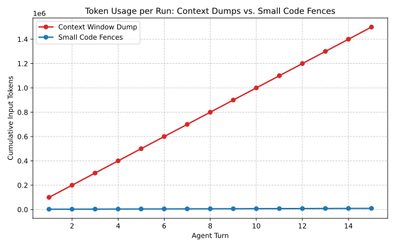

As context windows for Large Language Models expand into the millions of tokens, a dangerous anti-pattern has emerged in agent engineering: the "Context Window Dump." 

Instead of teaching agents to precisely navigate a repository, developers simply dump the entire codebase into the prompt. While this might yield quick results for trivial scripts, it destroys token efficiency and creates massive latency bottlenecks in recursive, multi-turn trajectories.

---

## 1. The Cost of the Dump

In a Recursive Language Model (RLM) loop, the context window grows with every turn. The agent sees the initial prompt, its own tool calls, and the tool responses. 

If you dump a 100,000-token codebase into the initial prompt, and the agent takes 15 turns to solve a problem, you are paying to process those 100,000 tokens *15 times*. 

$$ 100,000 \text{ tokens} \times 15 \text{ turns} = 1.5 \text{ million input tokens} $$

This isn't just expensive financially; it incurs massive Time-to-First-Token (TTFT) latency, slowing down the entire swarm.

---

## 2. Single-Cell Turn Discipline

In our orchestration framework, we advocate for **Small Code Fences** and **Single-Cell Turn Discipline**. 

Instead of dumping the codebase, the agent is given a strict set of precise tools (`grep_search`, `view_file` with line number constraints). The agent must actively explore the codebase, pulling only the snippets it needs.

### The Efficiency Curve

When an agent uses targeted tools, its context window starts small and grows linearly only with the specific information relevant to the task.

1. **Turn 1:** `grep_search("AuthModule")` (Returns 500 tokens of results). Total Context: 2,500 tokens.
2. **Turn 2:** `view_file("auth.py", start=10, end=50)` (Returns 300 tokens of code). Total Context: 3,000 tokens.
3. **Turn 15:** Total Context: 15,000 tokens.

$$ \text{Average Context (8,750)} \times 15 \text{ turns} = 131,250 \text{ input tokens} $$

By enforcing discipline, we achieve a >90% reduction in token usage compared to the dump method, while drastically improving execution speed.

---

## 3. Engineering for Precision

LLMs are capable of processing millions of tokens, but that doesn't mean they should. Massive context windows should be reserved for problems that inherently require massive context (like reading a 500-page PDF), not as a crutch to avoid building proper search and navigation tools for your agents. 

To build production-grade agent swarms, optimize for precision. Small fences build efficient agents.
