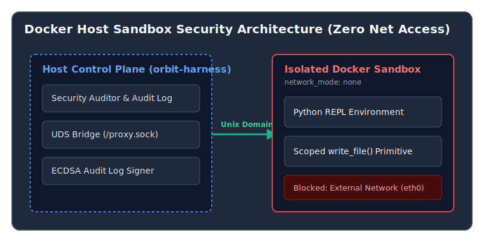

Imagine inviting a highly capable assistant into your office to organize your files, only to find they've accidentally emailed your private documents to the internet. This is the risk we face when giving autonomous AI agents—like those writing code or managing systems—free reign on a computer. Security cannot rely merely on politely asking the AI to "behave" through prompt instructions. Without strict, physical-like boundaries, an unconstrained agent can accidentally leak secrets, alter critical configurations, or make unauthorized connections to the outside world.

In this article, we break down how we solved this problem for our orchestration framework by building a **Zero Net Access** sandbox—a digital vault that completely cuts off the AI from the internet while still allowing it to do its job securely.

---

## Threat Model & Sandbox Requirements

Autonomous coding agents present three distinct attack and failure vectors:
1. **Outbound Data Exfiltration:** Model code attempting to send repository contents or environment variables to external endpoints via `curl` or `urllib`.
2. **Host Directory Traversal:** Ad-hoc file modifications escaping the task directory (`../`) into system files.
3. **Audit Tampering:** Modifying local execution logs to hide unapproved tool operations.

To mitigate all three vectors, our sandbox enforces three non-negotiable architectural invariants:
- **`network_mode=none`:** Complete hardware network isolation for the execution container.
- **IPC via Unix Domain Sockets (UDS):** Inter-process communication between host orchestrator and container REPL using a local domain socket mount (`/proxy.sock`).
- **ECDSA Signed Audit Log:** Every container execution event is hashed and signed on the host control plane.

---

## Architecture & Control Flow

The host control plane (our orchestration framework) initializes an ephemeral Docker container for each agent trajectory. Network adapters (`eth0`) are completely disabled at container creation time.



### UDS Inter-Process Communication

Because the container has no network interfaces, RPC communication between the host orchestrator and the Python REPL running inside the sandbox occurs via a mounted Unix Domain Socket:

```python
# orbit_harness/rlm/general/environments/docker_repl.py
def _create_container(self) -> None:
    self.container = self.client.containers.run(
        image=self.image,
        network_mode="none",  # Mandatory Zero Net Access
        volumes={
            str(self.uds_host_path): {"bind": "/workspace/proxy.sock", "mode": "rw"},
            str(self.project_root): {"bind": "/repo", "mode": "rw"},
        },
        detach=True,
    )
```

---

## Empirical Security Audit Results

We evaluated 29 benchmark study runs across multiple LLM provider models (Gemini 3.6 High/Medium/Low and DeepSeek v4 Flash) under the enforced Zero Net Access posture.

| Provider Group | Total Runs | Network Posture | Blocked Network Hits | Signed Audit Ratio | Sandbox Integrity |
| :--- | :---: | :---: | :---: | :---: | :---: |
| `cliproxyapi-gemini-3.6-flash-high` | 3 | `disabled` | 0 | 100% | **PASS** |
| `cliproxyapi-gemini-3.6-flash-medium` | 3 | `disabled` | 0 | 100% | **PASS** |
| `cliproxyapi-gemini-3.6-flash-low` | 3 | `disabled` | 0 | 100% | **PASS** |
| `deepseek-v4-flash` | 3 | `disabled` | 0 | 100% | **PASS** |

All 12 provider arm runs completed under complete network isolation. Cryptographic verification of the signed audit logs confirmed zero unverified operations or host traversal attempts.

---

## Key Takeaways

1. **Enforce Kernel-Level Boundaries:** Prompt engineering is not security. Use `network_mode=none` for all execution sandboxes.
2. **UDS Sockets for RPC:** Unix Domain Sockets provide high-performance, secure local IPC without opening loopback network ports (`127.0.0.1`).
3. **Cryptographic Auditing:** Sign every execution event on the host plane to guarantee audit trail tamper resistance.
